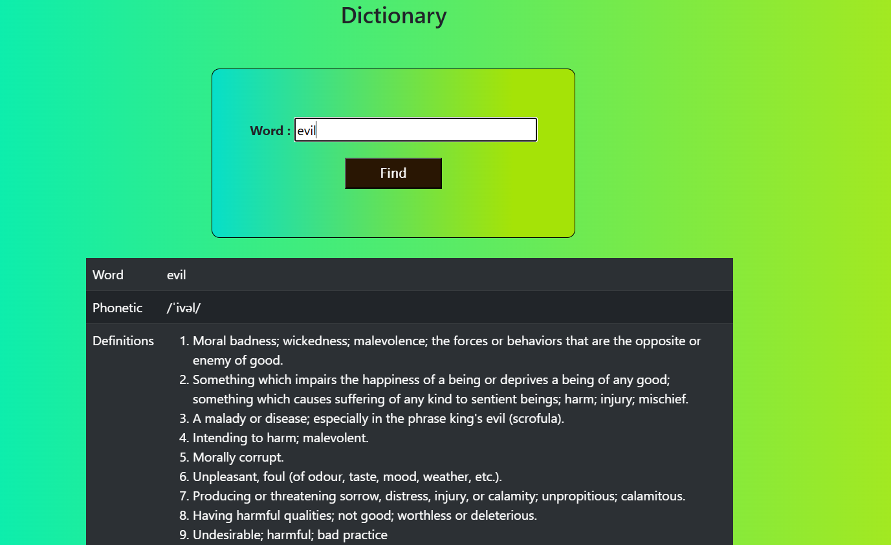

# 📖 promise-T-3(Dictionary App)

A simple dictionary web application that fetches word meanings, phonetics, synonyms, antonyms, and examples using the **Free Dictionary API**.  
This project demonstrates the use of **JavaScript Promises, async/await, API integration, and Bootstrap for UI**.

---

## 🚀 Features
- Search for any word in English.  
- Fetches data from the **Free Dictionary API**.  
- Displays:
  - Word & Phonetic  
  - Multiple Definitions  
  - Synonyms & Antonyms  
  - Usage Examples  
- Responsive design with Bootstrap.  
- Clean UI with gradient backgrounds and tables.  

---

## 📂 Project Structure
promise-T-3/
├── index.html # Main HTML file
├── style.css # Custom styles
└── script.js # Logic + API integration

---

## 🔧 Clone and Setup
1. Clone the repository:
   ```bash
   git clone https://github.com/Elanthiran/promise-T-3.git
   cd promise-T-3
   ```

---

## 📌 Usage

1. Enter a word in the input box.

2. Click on the Find button.

3. The app will fetch and display:

4. Definitions

5. Synonyms

6. Antonyms

7. Examples

---

## 📷 Screenshots



---
## 🛠️ Tech Stack

- HTML5 – Structure

- CSS3 – Styling & Gradients

- Bootstrap  – Layout & Components

- JavaScript (ES6) – API integration & DOM manipulation


---

## 🔮 Future Improvements

- Add voice pronunciation for words.

- Improve UI with animations & dark mode.

- Save recent search history.

- Add multiple language support.

- Provide related words & advanced filtering.

---

## 🤝 Contributing

Contributions are always welcome!

- Fork the repository

- Create a new feature branch (feature-branch)

- Commit your changes

- Open a Pull Request

---

## 📜 License

This project is licensed under the MIT License.
You are free to use, modify, and distribute this project.


